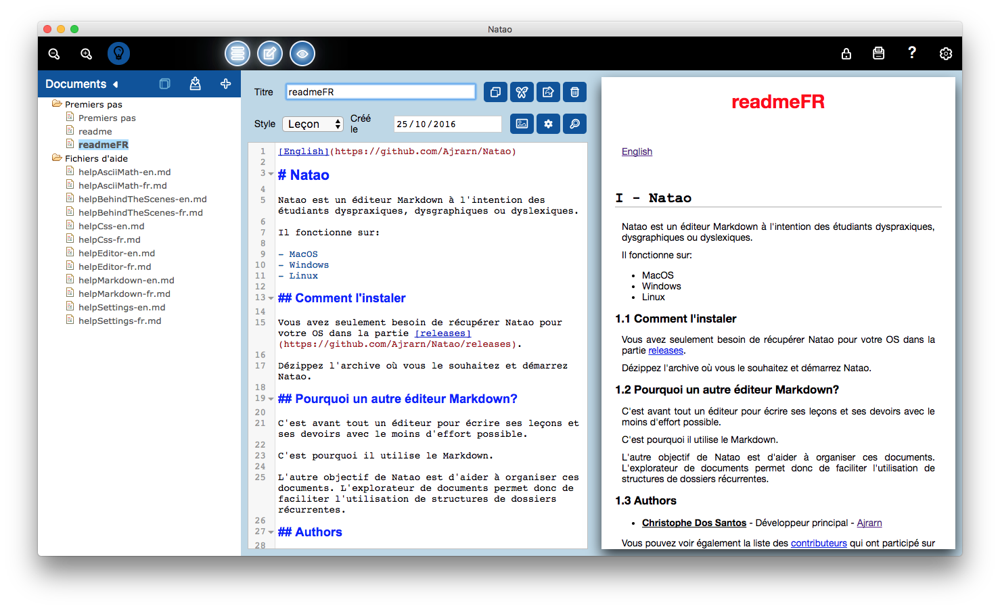

[Français](https://github.com/Ajrarn/Natao/blob/develop/README-fr.md)

# Natao

Natao is a Markdown editor specially made for student who are dyspraxic, dysgraphic or dyslexic.

It is made to work on MacOs, Windows and Linux.

## Getting Started

You only need to download Natao for your OS in the releases part:

[releases](https://github.com/Ajrarn/Natao/releases).

Unzip it where you want, and start Natao.

## Why another Markdown Editor ?

It is first an editor to write elegant lessons and school works with as less efforts as possible.

So this is why it use Markdown.

The other purpose is to help organize all these documents. So the document explorer is made to help recurrent patterns in document organization.

## Screenshot

## Authors

* **Christophe Dos Santos** - *Initial work* - [Ajrarn](https://github.com/Ajrarn)

See also the list of [contributors](https://github.com/Ajrarn/Natao/contributors) who participated in this project.

## License

This project is licensed under the MIT License - see the [LICENSE](LICENSE) file for details

## Acknowledgments

* All my friends for the tests and advices, and specially Alexandre Nothis for the English translation.
* Anne Missotte, ergotherapist, for some advices.
* All the people that made the library and tools used by Natao:
	* [Nwjs](http://nwjs.io/)
    * [AngularJs](https://angularjs.org/)
    * [CodeMirror](https://codemirror.net/)
    * [Showdown](https://github.com/showdownjs/showdown)
    * [NeDB](https://github.com/louischatriot/nedb)
    * and all the others.
* And my wife and our 2 kids that give me some time to do this software.
